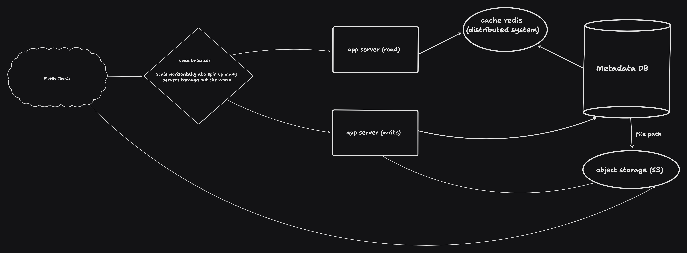

# Build Instagram

## A System design

### Brain storm features

1. Upload images from mobile client
   - Should this be a native app?
   - Mobile web?
   - Should we support other platforms?
   - Are there constraints like mobile network or phone storage space?
2. Allow users to follow other users
3. Generate a feed of images
   - Whats the expected latency of uploading images?
   - should content be fresh?
4. Scale to 10 million users
   - What scale do we need our system to work at?

---

### Breaking down the scale:

10 million users monthly basis

- On average each user uploads 2 photos a month
- ~5MB/photo including other photo metadata

  Crunching the numbers: 1,000,000 _ 2 _ 5MB = `10,000,000 MB`
  which is ~`10TB` of storage/month

---

### Data model

1. users
2. photos
3. userFollowing

- We can use different types of DBs, but in this case:

  - a `user` can have many userFollowers
  - many userFollowers can follow one `user`
  - a `user` can have a lot of photos

  This lends itself to a 'relational' DataBase

## SQL Tables:

| user     |                         |
| -------- | ----------------------- |
| id       | primarykey, int, serial |
| name     | string                  |
| email    | string                  |
| location | string                  |

---

| photo       |                                 |
| ----------- | ------------------------------- |
| id          | primarykey, int, serial         |
| user_id     | foreign key referencing user.id |
| description | string                          |
| location    | string                          |

---

| userFollowing |                                 |
| ------------- | ------------------------------- |
| user_from     | foreign key referencing user.id |
| user_to       | foreign key referencing user.id |

---

### Flow

> used https://www.tldraw.com/ to draw

